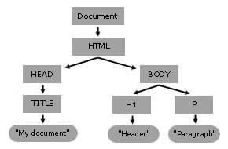

DOM 是瀏覽器將文件轉換成可被程式操作的 **<mark>物件樹 (由物件和節點 node 組成)</mark>**，使 JavaScript 能讀取、修改網頁，以及處理使用者事件。

---

## 	Concept and Usage

- 所有網頁上<mark>可操作的屬性、方法、事件</mark>都是 **<mark>"物件"</mark>**
- <mark>多個 API</mark> 協作形成 DOM，例如: Core DOM, Web API
- **DOM 與 JavaScript 的關係:**
  - DOM 不屬於 JavaScript
  - DOM 是獨立於任何一種程式語言 → 可以彈性接受任何語言
  - 直接在 `<script>` 裡面使用 JavaScript 來操作 DOM API

---

### DOM Tree



- Web Browser 解析 (parse) HTML document → build DOM tree ⇒ 渲染 (render) 出網頁
- 可以把 DOM 想成一間「公司」:
  - `Node` = **公司所有員工的共同身分**只要是在 DOM Tree 裡的節點，基本上都屬於 Node。
  - `Document` = **整間公司的總管理者**
  - `Element` = **員工中的一個職系，例如「工程師」**它是 Node 的一種，但多了「元素」才需要的能力，例如 `classList`、`getAttribute()`。
  - `HTMLElement` = **工程師裡的「前端工程師」**它是 Element 的一種，專門代表 HTML 元素，又多了 HTML 專屬能力。
  - `HTMLInputElement` = **前端工程師裡的「表單工程師」**
    它更專門，只代表 `<input>`，所以又多了 `value`、`checked` 等能力。

---

### DOM & Interface

- 一個 DOM object 通常可以<mark>繼承多個 interface 的特性</mark> (因為 interface 是層級關係)

```text
Node
 ↑
Element
 ↑
HTMLElement
 ↑
HTMLTableElement
```

---

### Fundamental Data Type

1. `Document`是代表整個 DOM 的 <mark>document 根物件</mark>
2. `Node`每個 DOM document 裡面的元素都是一種 Node 節點→ 所有的 document 都是 Node 節點，但並非所有的 Node 都是 document
3. `Element`代表<mark>元素標籤</mark>的物件，也是一種 Node 節點 (<mark>同時具備 Element interface 和 Node interface</mark>)→ `<div>`、`<p>`、`<table>` 在 DOM 中都會對應成一個 Element 物件
4. `Attr`
   也是 Node 節點的一種 (<mark>屬性節點</mark>)

---

### HTML DOM

HTML DOM 會在核心 DOM 的 `Element` 等 interface 基礎上，擴充出 `HTMLElement` <mark>以及各種 HTML 元素專屬的 interface</mark>，提供 HTML 特有的屬性與方法。

```text
Node
└─ Element
   └─ HTMLElement
      ├─ HTMLDivElement
      ├─ HTMLInputElement
      └─ HTMLTableElement
```

---

## DOM 的查詢

### querySelector / querySelectorAll

- `document.querySelector(selector)`
  - 使用 <mark>CSS selector</mark> 查找
  - 回傳符合 CSS selector 的第一個 <mark>Element (node)</mark>
- `querySelectorAll()`
  - 回傳符合條件的 <mark>NodeList (並非 Array)</mark>
  - 可以使用部分 Array 方法 (`.forEach` 等) → <mark>array-like collection</mark>

---

### NodeList / Live Collection

```javascript
const list = document.querySelector("ul");
const staticItems = list.querySelectorAll("li"); // snapshot-like
const liveItems = list.children; // live collection

list.append(document.createElement("li"));

console.log(staticItems.length); // 原本數量
console.log(liveItems.length); // 新數量
```

- `querySelectorAll()` 這個 DOM collection <mark>回傳的  是 static</mark> (使用 "快照")→ 所以 append 後，仍然是之前快照狀況
- `.children` <mark>回傳的是 live collection </mark> 持續反映當前 DOM 狀況
  → 所以 append 後，仍然是當前狀況

---

## Attribute / Property

### Attribute 與 Property 的差異

#### HTML Attribute

- HTML 標籤上的屬性
- 可以用 `getAttribute()`、`setAttribute()` 等存取

#### JS Property

- JS object 的屬性
- 通常直接點號存取 property (例如: `element.value`)
- 描述當前 runtime 的動態狀況

---

### HTML Attribute: `data-*` / `dataset`

```html
<button data-action="delete" data-item-id="42">Delete</button>
```

```javascript
button.dataset.action; // "delete"
button.dataset.itemId; // "42"
```

- 在 HTML 標籤上加上 `data-*` 的 attribute → 使用 `dataset` 取得所有 data attributes
- 可以直接用 CSS 選擇器控制所有相同 data attribute 的元素：

```html
<button data-action="delete" data-item-id="42">Delete</button>
<button data-action="delete" data-item-id="43">Delete</button>
```

```javascript
const buttons = document.querySelectorAll('[data-action="delete"]');

buttons.forEach(button => {
  button.addEventListener("click", () => {
    // delete
  });
});
```

---

## Event Model

### Event 運作架構

```text
EventTarget
↓
addEventListener() 註冊 listener
↓
某個 event 發生
↓
建立 Event object
↓
listener 被呼叫
↓
listener 透過 Event object 知道這次事件的資訊
```

---

### Event 組成要素

#### EventTarget

- 可以處理事件的物件
  如 `button`, `window`, `document`

#### Event Object

- 事件發生時產生的物件

```javascript
button.addEventListener("click", (event) => {
  console.log(event);
});

// event object 裡面的常見屬性
event.type
event.target
event.currentTarget
event.bubbles
event.timeStamp
```

#### Event

- 事件本身名稱
  如 `click`, `input`

#### Event Listener

- 事件產生後會執行的函式

```javascript
function handleClick(event) {
  console.log("clicked");
}
```

- 一個事件可能會有多個 listener：

```javascript
const button = document.querySelector("#btn");

// listenerA
function listenerA() {
  console.log("A");
}
// listenerB
function listenerB() {
  console.log("B");
}

// click event 有兩個 listener
button.addEventListener("click", listenerA);
button.addEventListener("click", listenerB);
```

---

### target / currentTarget

```html
<div id="card">
  <button>
    <span>Save</span>
  </button>
</div>
```

```javascript
card.addEventListener("click", (event) => {
  console.log(event.target); // span
  console.log(event.currentTarget); // card
});
```

#### `target`

- 真正觸發事件的最內層物件

#### `currentTarget`

- 當前正在執行事件處理函式的物件（即監聽事件的 `EventTarget`）

---

### Event Delegation (事件委派)

```html
<ul id="list">
  <li><button data-id="1">Delete</button></li>
  <li><button data-id="2">Delete</button></li>
</ul>
```

```javascript
list.addEventListener("click", event => {
  const button = event.target.closest("button");

  if (!button) return;

  console.log(button.dataset.id);
});
```

- 只需<mark>將事件 listener 綁在父元件</mark>上，不需要將 listener 綁在所有子元件上
- 利用 <mark>event bubbling</mark> 判斷是哪個子元素被點擊 (`target`)

```text
點擊 button
↓
click 事件往上 bubbling
↓
傳遞到 ul#list
↓
父層 listener 收到事件
↓
透過 event.target 找出是哪顆 button
```
