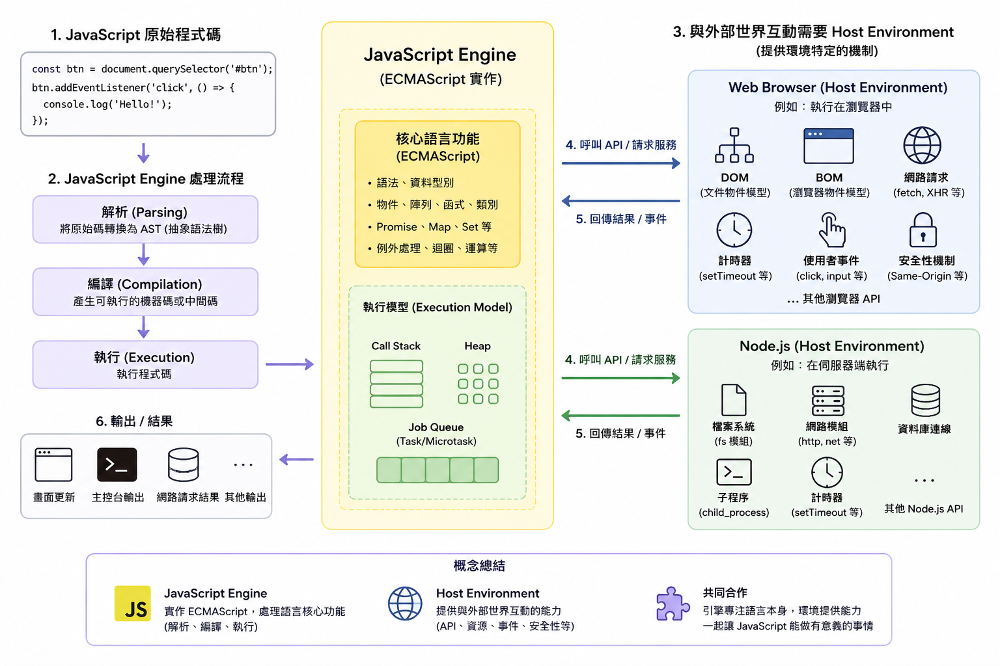
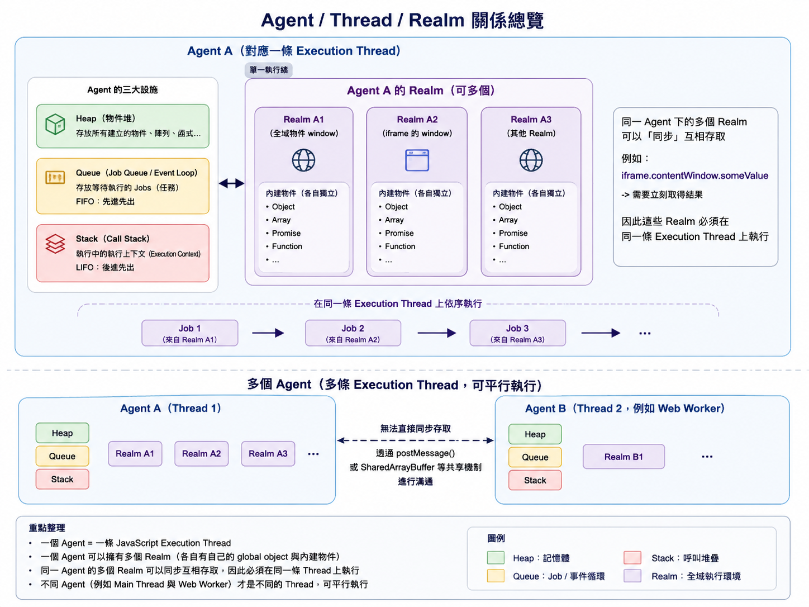
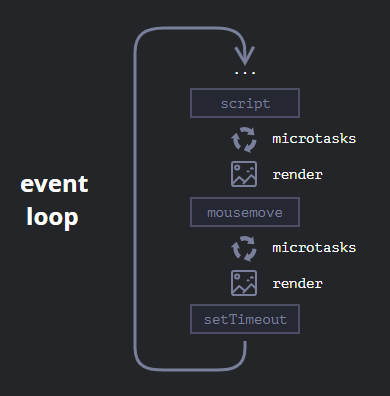
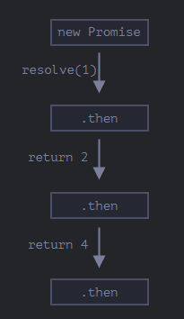

## Event Loop

- **同步（Synchronous）＝一件做完，才做下一件。**
- **非同步（Asynchronous）＝有些工作需要等待，就先去做別的，完成後再回來處理。**
- **Execute flow：** 有 Task 就執行 (FIFO) → 沒 Task 就等待 → 有 Task 就執行 (FIFO) …
- 在 Task（一個 script）執行完成後，才會進行 rendering

---

### Execution Model

[JavaScript execution model - JavaScript | MDN](https://developer.mozilla.org/en-US/docs/Web/JavaScript/Reference/Execution_model)

#### The engine and the host



JavaScript 的執行有**兩大必要條件**：JavaScript engine 和 host environment

1. **JavaScript engine：** source code → parse → execute
2. **host environment：** 和外部世界互動，例如：
   - 執行在瀏覽器中 → Browser
   - 執行在伺服器中 → Node.js

---

#### Agent Execution Model



```
Browser = 整座工廠
│
├─ Agent A = 一個生產部門
│  ├─ Thread = 這個部門唯一一條主要作業線
│  ├─ Stack = 作業員手上的工作堆疊
│  ├─ Queue = 等待處理的工作排隊區
│  ├─ Heap = 倉庫
│  │
│  ├─ Realm 1 = 辦公室 A（Main Window）
│  └─ Realm 2 = 辦公室 B（iframe）
│
└─ Agent B = 另一個生產部門（例如 Web Worker）
   ├─ Thread
   ├─ Stack
   ├─ Queue
   ├─ Heap
   └─ Realm
```

##### agent（一個 JS 的執行器）⇒ 單一執行緒（thread）

每個 agent 裡面都會包含：

1. **Heap（Objects）**

   記憶空間，隨著 Object 的建立被不斷擴充；每個 agent heap 都有一個 [`SharedArrayBuffer`](https://developer.mozilla.org/en-US/docs/Web/JavaScript/Reference/Global_Objects/SharedArrayBuffer)，但不同 agent 的 `SharedArrayBuffer` 都是指到同一個底層記憶體（RAM）。
2. **Queue（jobs）**

   Event Loop，延續單一執行緒的非同步設計；**first-in-first-out** 的堆疊原則。
3. **Stack（contexts）**

   Call Stack 用來控制現在執行哪些 function 及執行完要回到哪裡；**last-in-first-out** 的執行原則。

   → 每個 **worker**（獨立於 Main Thread 的 JavaScript 執行環境）都會建立一個 agent

---

##### Realms

- 一個 agent 可以有多個 realms，在同一條 thread 上可以同步互相存取。
- 一個全域物件（某個 JavaScript 執行環境中，最外層的共用物件，例如 Window）對應一個 realm。

每個 Realm 包含：

1. **JavaScript 內建物件**：`Array`、`Object`、`Function`、`Promise`、`Error`
2. **全域環境（Global this）**：例如 window 這個 realm 的全域變數
3. **快取（cache）**

---

##### Stack

用來追蹤 execution context。

**Execution context** 記錄：

1. 現在執行到哪一行？
2. 現在在執行哪個 code？（script？module？function？）
3. 屬於哪個 realm
4. Binding：值和變數的關係、this 指向

```
function 被呼叫
      ↓
建立 Execution Context
      ↓
放進 Call Stack
      ↓
Execution Context 記錄
├─ 現在執行到哪
├─ 哪個 function / script
├─ 屬於哪個 Realm
├─ local variables
├─ function / class bindings
└─ this
      ↓
function 執行完成
      ↓
Execution Context 從 Stack 移除
```

**Execution context 生命週期的例外狀況：Generator**

- **迭代器（Iterator）** 的應用；用於建立**可迭代的資料生產線**，或需要**分段執行、可中途暫停**的流程
  - `g.next()` 執行 → 碰到 `yield` **暫停** → 下次 `g.next()` 執行從上次 `yield` 的地方開始

```
建立 Execution Context
        ↓
先 suspend
        ↓
g.next()
        ↓
push 進 Call Stack
        ↓
執行到 yield
        ↓
suspend
        ↓
從 Stack 移除
        ↓
但 Execution Context 被保存
        ↓
g.next()
        ↓
重新 push 回 Stack
        ↓
從 yield 後面繼續
```

[暫停一下再出發！全面解析 JavaScript Generator 實用技巧 | Bosh 的技術探索筆記](https://notes.boshkuo.com/docs/Javascript/js-generator)

---

##### Job, Queue, Event Loop

網路瀏覽器的需求不能使程式執行原地等待（**never blocking**），所以 JS 在非同步處理上，會放到 job queue 等待（**callback function**），搭配 **run-to-completion** 的特性，等待 task completed 後，再依序（first-in-first-out）取出 queue 中的執行。

---

#### Memory Sharing

##### **Agent Cluster** = 可**共享同一個記憶體底層**（`SharedArrayBuffer`）的不同 agent 群集

| 關係                                    | 同 Agent Cluster？ | 可共享記憶體？ |
| --------------------------------------- | ------------------ | -------------- |
| Window ↔ Dedicated Worker              | 是                 | 可以           |
| Worker ↔ 它建立的 Dedicated Worker     | 是                 | 可以           |
| Window ↔ 同源 iframe                   | 是                 | 可以           |
| Window ↔ 同源且有 opener 關係的 Window | 是                 | 可以           |
| Window ↔ Worklet                       | 是                 | 可以           |
| Window ↔ Shared Worker                 | 否                 | 不可以         |
| Window ↔ Service Worker                | 否                 | 不可以         |
| Window ↔ 跨來源 iframe                 | 否                 | 不可以         |
| 兩個互不相關的 Window                   | 否                 | 不可以         |

---
##### Agent Cluster 如何共享記憶體、傳遞資料

兩種方法：

1. **Normal Memory Access**：直接存取共享記憶體 → agent A 和 agent B 可能同時執行，導致 concurrency 問題
2. **Atomic Memory Access**：把對共享記憶體的操作包成 Atomic，透過 Atomic 去存取共享記憶體 → 所有 Agent 對這些 Atomic 操作看到的是**同一套全域先後順序**

##### 共享記憶體後的 Concurrency 問題（race condition）

多個 agent 同時存取、操作共享記憶體，可能導致 race condition 問題；若所有 agent 都被卡住，就會出現 deadlock 問題。

避免 Deadlock 的規範限制：

1. **Dedicated Worker / Shared Worker**（背景執行 agent）→ **允許被 block**
2. **Window Worker / Service Worker**（真正對外溝通）→ **不允許被 block**
3. **沒有被 block 的 agent 要有機會被執行** → **forward progress**
4. **整個 Agent Cluster 應該一起被終止**，因其中一個 blocked agent 可能持有 lock，導致其他 agent 無限等待，形成 deadlock

---

### MicroTask

[Using microtasks in JavaScript with queueMicrotask() - Web APIs | MDN](https://developer.mozilla.org/en-US/docs/Web/API/HTML_DOM_API/Microtask_guide)

- **Browser / Web worker event loop** 在下一個 task 執行前要清空的小任務
- **生命週期：**
  1. function 創建時建立，放入 **Microtask queue**
  2. **Call Stack 清空**後執行
  3. 執行後，Microtask 清空後，才繼續進行 event loop 的**下一個 task**

---

#### (Macro) Task & Microtask

[Event loop: microtasks and macrotasks](https://javascript.info/event-loop)



##### 一個 Event Loop

- Task 執行完畢（Call Stack 清空）後 → 清空 Microtask queue 中的 microtasks → Browser rendering → 進行 Task queue 的下一個 Task
- Task queue / Microtask queue：**first-in-first-out（FIFO）**

##### (Macro) Task

Task = Macro task

- 從 task queue 中依序執行，**一次執行一個 macro task**
  - `<script>` 是一個 task
  - `DOM event` 是一個 task
  - `Callback` 是一個 task，會排到 task queue 中，成為下一個執行的 task

##### Microtask

- Task 執行中碰到 microtask → 排到 microtask queue → 一個 task 結束後，**一次清空所有 queued microtasks**
  - `await` 後面的 code 會產生一個 microtask
  - `Promise` 會產生一個 microtask
- **Microtask starvation：** microtask 中又不斷產生 microtask，大量佔用 main thread，導致 blocked

---

## Promise

一個表示非同步操作最終結果（成功或失敗）的物件。

- 常見狀態是 `pending`、`fulfilled`、`rejected`
- `fulfilled` 或 `rejected` 統稱為 `settled`，狀態一旦 settled 就不再改變。

### Chaining

- 成功操作 → 執行後續操作 → 成功操作 → 執行後續操作 …

  因為 `.then` 每次都會回傳新的 Promise

	

- `async/await` **建立在 Promise 機制之上**
  - `async` 一定會回傳一個 **Promise**，讓程式更清晰易讀
  - `await` 等待一個值（視為 `Promise.resolve()`）

---

### Error Handling

- `catch()`：可以在 catch 之後繼續 chaining
- `async/await` → `try/catch`

---

#### Nesting

```javascript
doSomethingCritical()
  .then((result) =>
    doSomethingOptional(result)
      .then((optionalResult) => doSomethingExtraNice(optionalResult))
      .catch((e) => {}),
  ) // Ignore if optional stuff fails; proceed.
  .then(() => moreCriticalStuff())
  .catch((e) => console.error(`Critical failure: ${e.message}`));
```

---

#### Promise Reject Event

##### Browser

如果一個 Promise 被 reject 後沒有被 `.catch()` 或其他 rejection handler 處理，瀏覽器會將「未處理的錯誤事件」冒泡到全域。

兩種「未處理的錯誤事件」：

1. `unhandledrejection`：有一個 Promise reject 了，但目前沒有人處理它。
2. `rejectionhandled`：本來沒有人處理的 Promise reject，後來被處理了。

---

### Composition

執行 Promise 的四種工具。

在不依賴前一個函式結果的狀況下，適合使用**非同步（併行）**的 Promise：

1. `Promise.all()`

   全部跑完後，只要其中一個失敗就會 rejected（只會 return catch error）；全部成功才會 resolved（return fulfilled）。
2. `Promise.allSettled()`

   全部跑完後，會依序回傳所有結果（陣列）。
3. `Promise.any()`

   全部跑完後，只要碰到第一個成功就會 return fulfilled；除非全部失敗，才會 return catch error。
4. `Promise.race()`

   只回傳最快完成的結果，不論是成功還是失敗。

---

## Closure

將函數和建立時的變數環境（Lexical environment）綁在一起的封閉組合。

- **Lexical environment：** 建立時（寫在哪）的變數環境，以及對**外層 lexical environment** 的引用，串成 **Scope Chain**，決定變數的作用域。

#### Closure Scoped Chain

- **巢狀函式：** 內層 function 會透過外層 Lexical Environment 的引用，沿著作用域逐層向外查找變數，形成 **lexical scope chain**。

```javascript
// global scope
const e = 10;
function sum(a) {
  return function (b) {
    return function (c) {
      // outer functions scope
      return function (d) {
        // local scope
        return a + b + c + d + e;
      };
    };
  };
}

console.log(sum(1)(2)(3)(4)); // 20
```

- **Vue 實例 → 更新 loading state**

```javascript
// global lexical
export function useRequest() {
  // outer lexical
  const loading = ref(false)
  const error = ref<Error | null>(null)

  async function execute() {
    // inner lexical
    loading.value = true
    error.value = null

    try {
      // request...
    } catch (err) {
      error.value = err as Error
    } finally {
      loading.value = false
    }
  }

  return {
    loading,
    error,
    execute,
  }
}
```

---

#### Private Method

使用 closure 來設定 private method，禁止外部直接訪問。

```javascript
const counter = (function () {
  let privateCounter = 0;
  function changeBy(val) {
    privateCounter += val;
  }

  return {
    increment() {
      changeBy(1);
    },

    decrement() {
      changeBy(-1);
    },

    value() {
      return privateCounter;
    },
  };
})();
```

- **IIFE（立即函式）：** 立即執行建立 lexical environment → 變數 `privateCounter`、函式 `changeBy`
- **Public：** `increment`、`decrement`、`value` → 外部可以 access
- **Private：** `changeBy` → 外部不可以直接 access

---

#### Performance

大量使用 closure 建置物件，會造成不必要的記憶體消耗。

##### Closure

```javascript
function MyObject(name) {
  this.name = name;

  this.getName = function () {
    return this.name;
  };
}

a.getName === b.getName; // false
```

- 每次 `new MyObject` 都會建立一組 `name`、`getName`，**重複建立，佔用記憶體**。

##### Prototype

```javascript
function MyObject(name) {
  this.name = name;
}

MyObject.prototype.getName = function () {
  return this.name;
};

a.getName === b.getName; // true
```

- 多個 `MyObject` instance **共用一個 prototype** 中的 `getName` 方法

---

## Prototype

#### Prototype Chain

1. 每個物件都有一個內部的 `[[Prototype]]`：讀取屬性時會優先找自己，再往外層 Object 找，直到 `null` 為止

```
child
 ↓
parent
 ↓
Object.prototype
 ↓
null
```

2. `Method`：只是依附在某個 Prototype 上的 function property
   - 除了 `Arrow function`，它沒有預設 `.prototype`，不能搭配 `new`

```javascript
const doSomethingFromArrowFunction = () => {};

console.log(doSomethingFromArrowFunction.prototype); // undefined
```

3. `Constructor.prototype` = new 出來的實例的 `[[Prototype]]`

```javascript
function Box(value) {
  this.value = value;
}

Box.prototype.getValue = function () {
  return this.value;
};

const box = new Box(10);
Object.getPrototypeOf(new Box()) === Box.prototype;
```

```
box
 ↓ [[Prototype]]
Box.prototype
 ↓
Object.prototype
 ↓
null
```

4. `Class` 的底層就是 `[[Prototype]]`

```javascript
class Box {
  constructor(value) {
    this.value = value;
  }

  // getValue 會放在 Box.prototype
  getValue() {
    return this.value;
  }
}
```

---

#### The rules

**Prototype** 只用來**讀取**；**寫入**和**刪除**都會直接針對 **Object** 本身

##### 一般寫入

直接寫在 Object 本身，不會影響 prototype

→ `rabbit.walk()` 不會再使用 `animal.walk()`，而是**建立一個新 function 在自己 `rabbit` 物件身上**

```javascript
let animal = {
  eats: true,
  walk() {
    /* this method won't be used by rabbit */
  },
};

let rabbit = {
  __proto__: animal,
};

rabbit.walk = function () {
  alert("Rabbit! Bounce-bounce!");
};

rabbit.walk(); // Rabbit! Bounce-bounce!
```

##### 例外：getter/setter

若屬性是 accessor property，則會改為呼叫 accessor（setter）

→ admin 往上找到 user 有 `set fullName`，故會**使用此 setter 進行賦值（this 指向 admin）**，而非新建立。

```javascript
let user = {
  name: "John",
  surname: "Smith",

  set fullName(value) {
    [this.name, this.surname] = value.split(" ");
  },

  get fullName() {
    return `${this.name} ${this.surname}`;
  },
};

let admin = {
  __proto__: user,
  isAdmin: true,
};

alert(admin.fullName); // John Smith (*)

// setter triggers!
admin.fullName = "Alice Cooper"; // (**)

alert(admin.fullName); // Alice Cooper, state of admin modified
alert(user.fullName); // John Smith, state of user protected
```
